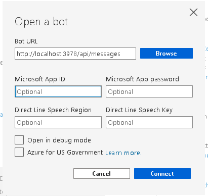
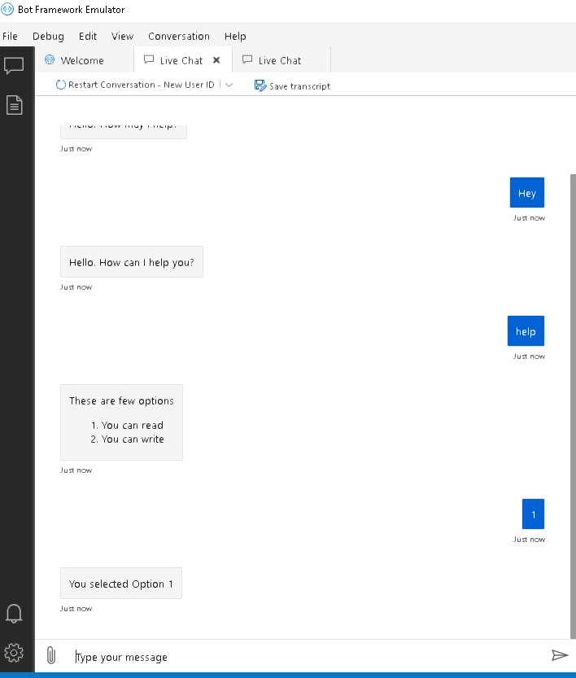
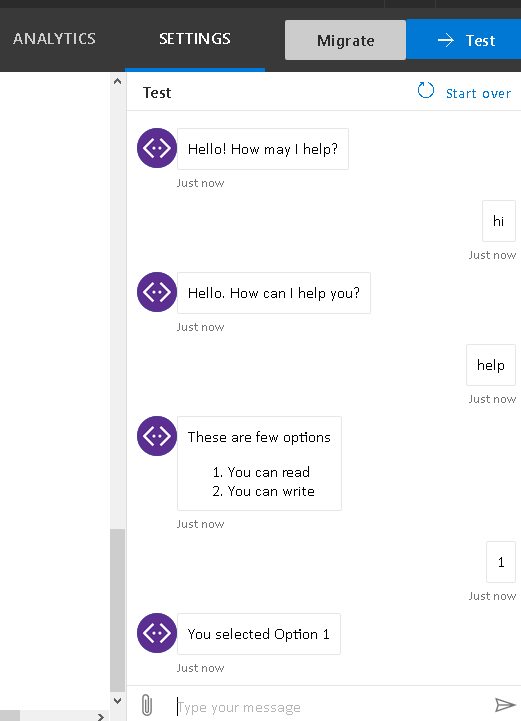
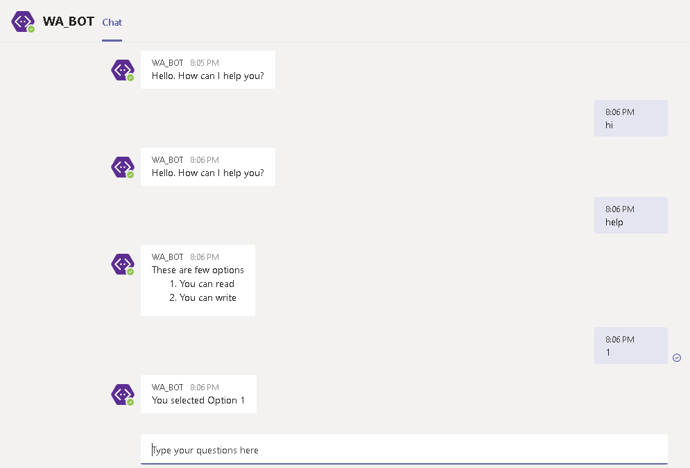

# IBM Watson Assistant Integrated with Microsoft Teams

A sample bot for communication between Microsoft Teams and Watson Assistant - IBM Cloud V2 API

## Introduction

To integrate Watson Assistant with Microsoft Apps, we are going to use Microsoft BOT Framework.
Please note this app uses the [Watson Assistant V2 API](https://cloud.ibm.com/apidocs/assistant-v2#introduction).

## Prerequisites

1. Sign up for an [IBM Cloud account](https://cloud.ibm.com/registration/).
2. Download the [IBM Cloud CLI](https://cloud.ibm.com/docs/cli/index.html#overview).
3. Create an instance of the Watson Assistant service:
    - Go to the [Watson Assistant](https://cloud.ibm.com/catalog/services/conversation) page in the IBM Cloud Catalog.
    - Log in to your IBM Cloud account.
    - Click **Create**
    - Click **Show** to view the service credentials.
    - Copy the `API Key` and `URL` value.
4. Download [IBM Cloud CLI](https://cloud.ibm.com/docs/cli?topic=cli-install-ibmcloud-cli)
5. Download [NPM/NodeJS](https://nodejs.org/en/download/)
6. Download [BOT Framework Emulator](https://github.com/Microsoft/BotFramework-Emulator/releases)
7. Check access for [Azure Portal](https://portal.azure.com/)
8. Check access for for [Bot Framework Dev Console](https://dev.botframework.com/)

## Instructions

**Step 1.** 

Import a new skill(/skill/skill-My-first-skill.json) in Watson Assistant.


**Step 2.**

Go to Assistant Settings and get the following details - 

    
    Assistant ID
    
	
**Step 3.**

Open you .env file and Add the Assistant ID value you obtained in step 2 and AssistantURL and APIKey obtained during the pre-requisite against the respective keys.

    
    AssistantID=
    AssistantURL=
    APIKey=
    

You can keep the following 2 blank for now
    
    MicrosoftAppId=
    MicrosoftAppPassword=
    

**Step 4.**

Run the following command

``npm install``

**Step 5**

Run the following command 

``npm start``

**Step 6.**

Open BOT Emulator and click on Open Bot from File Menu




Add BOT URL As -

	http://localhost:3978/api/messages
	
Click on Connect

**Step 7.**

Test your BOT





## Deploying the BOT to Azure

**Step 1.**

Go to [My Bots](https://dev.botframework.com/bots) page on Azure Portal

**Step 2.**

Create New

**Step 3.**

Add the Required Details details.

**Step 4.** 

Endpoint - We will see this in next section.

**Step 5.**

Click on `Create Microsoft App ID and password` and Register your BOT.

**Step 6.**

Copy the Application ID and add it to .env File as MicrosoftAppId

**Step 7.**

On the Left Panel of Blade click on Certificates and Secrets. Then Click on New Client Secret And generate.  Copy this code against MicrosoftAppPassword in .env file.

**Step 8.**

Save Changes


## Deploying to IBM Cloud as a Cloud Foundry Application

1. Login to IBM Cloud with the [IBM Cloud CLI](https://cloud.ibm.com/docs/cli/index.html#overview)

    ```
    ibmcloud login
    ```

2. Target a Cloud Foundry organization and space.

    ```
    ibmcloud target --cf
    ```

3. Edit the *manifest.yml* file. Change the **name** field to something unique.  
  For example, `- name: my-app-name`.
4. Deploy the application

    ```
    ibmcloud app push
    ```

5. View the application online at the app URL.  
	For example: https://my-app-name.mybluemix.net


6. Add this URL to your Microsoft BOT Endpoint as 

	https://my-app-name.mybluemix.net/api/messages

7. Test Your BOT




Now, you can deploy this BOT to Microsoft Teams by Registering it to Teams Channel.



You can go ahead and [deploy your bot to microsoft teams](https://docs.bmc.com/docs/bmcchatbot/cloud/enabling-microsoft-teams-in-a-chatbot-application-by-registering-inline-with-microsoft-app-studio-870730567.html#EnablingMicrosoftTeamsinachatbotapplicationbyregisteringinlinewithMicrosoftAppStudio-register_inline)


